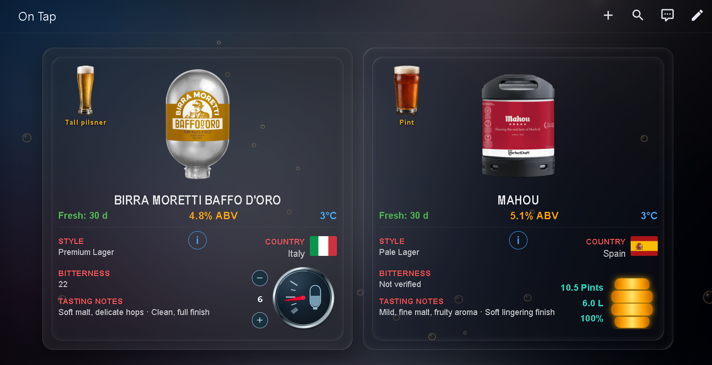

# PerfectDraft Pro + Blade On Tap for Home Assistant

A Home Assistant dashboard for **PerfectDraft Pro** and **Blade** keg systems, with keg artwork, glass recommendations, country flags, freshness, ABV, temperature, remaining volume and Blade pint tracking.

## Screenshot




### Beer category dropdowns

The updated dashboard groups beers into collapsible categories so you can expand only the section you want.


> **Current release:** `v1.0.0`  
> **Tested:** successfully on a live Home Assistant installation using the HACS asset path.  
> HACS installs the frontend assets; Home Assistant helpers/templates/automations are installed separately from `packages/perfectdraft_on_tap.yaml`.

## What this project includes

- PerfectDraft Pro card with live temperature, freshness, keg remaining and beer details
- Blade card with manual keg selection, 14-pint counter and 30-day freshness tracking
- Beer artwork for PerfectDraft and Blade
- Recommended glass artwork and country flags
- Home Assistant package YAML for required helpers/templates/automations
- Optional PerfectDraft visual theme

## Requirements

- Home Assistant
- HACS
- **Button Card** (`custom:button-card`)
- **Expander Card** (`custom:expander-card`, Alia5/lovelace-expander-card)
- For the PerfectDraft Pro side: `Falkvinge/hassio-integration-perfectdraft-pro`

The Blade side works without a smart Blade integration.

## Choose your installation path

### HACS + fresh Home Assistant setup

Use this if you are installing the project for the first time:

1. Install the frontend assets through HACS.
2. Install `packages/perfectdraft_on_tap.yaml` for the helpers, template sensors and Blade automations.
3. Import `dashboard/on_tap_hacs.yaml`.

Full step-by-step instructions are in [`INSTALL.md`](INSTALL.md).

### Existing PerfectDraft / Blade setup

If you already have working helpers or template sensors, **do not blindly install the package YAML**. Existing entity IDs may differ from the public defaults. Compare your entities using `reference/ENTITY_MAPPING.md`, then adapt the dashboard references if required.

### Fully manual installation

Use this route if you do not want HACS to manage the artwork.

## Manual installation

### 1. Install Button Card

Install **Button Card** from HACS and reload/restart Home Assistant if requested.

### 2. Install the artwork

Copy:

`www/perfectdraft/`

to:

`/config/www/perfectdraft/`

Home Assistant exposes this as:

`/local/perfectdraft/`

### 3. Install the Home Assistant package

Copy:

`packages/perfectdraft_on_tap.yaml`

to:

`/config/packages/perfectdraft_on_tap.yaml`

If packages are not already enabled, merge this into your existing `homeassistant:` block:

```yaml
homeassistant:
  packages: !include_dir_named packages
```

Restart Home Assistant after validating configuration.

The package creates the Blade selector, insertion datetime, pint counter, Blade freshness sensor, PerfectDraft selector, PerfectDraft ABV/pints/pours sensors and three Blade automations.

### 4. Configure PerfectDraft Pro

Install and configure the PerfectDraft Pro integration with your own account.

Expected integration entities include:

- `sensor.perfectdraft_pro_temperature`
- `sensor.perfectdraft_pro_keg_remaining`
- `sensor.perfectdraft_pro_keg_freshness`
- `sensor.perfectdraft_pro_pours`
- `sensor.perfectdraft_pro_keg`
- `sensor.perfectdraft_pro_keg_product`
- `button.perfectdraft_pro_mark_keg_changed`

Entity IDs can differ on another installation. See `reference/ENTITY_MAPPING.md`.

### 5. Import the dashboard

Create a new Home Assistant dashboard or view, open the **Raw configuration editor**, and paste the contents of:

`dashboard/on_tap.yaml`

### 6. Select the current kegs

Use:

- `input_select.blade_current_keg`
- `input_select.perfectdraft_current_keg`

Changing the Blade keg automatically stamps the insertion time and resets the Blade counter to 14 pints.

## HACS frontend installation

1. In HACS, add this repository as a **Dashboard** custom repository:
   `tkrizius-droid/perfectdraft-blade-on-tap`
2. Download **PerfectDraft + Blade On Tap**.
3. HACS installs the files from `dist/` under `/config/www/community/perfectdraft-blade-on-tap/`.
4. Use `dashboard/on_tap_hacs.yaml` as the HACS dashboard variant. Its artwork paths use:
   `/hacsfiles/perfectdraft-blade-on-tap/perfectdraft/...`
5. Copy `packages/perfectdraft_on_tap.yaml` to `/config/packages/` separately, then restart Home Assistant after validating configuration.

HACS handles the frontend assets; it does **not** create the Home Assistant helpers, template sensors or automations contained in the package YAML.

## Optional theme

Copy `themes/perfectdraft.yaml` to `/config/themes/perfectdraft.yaml`.

For the full theme behaviour, install **card-mod** through HACS.

## Background

The original private uploaded background was deliberately excluded. The dashboard works without it.

## Known ABV limitation

The ABV lookup is preserved from the source configuration and currently covers fewer beers than the full PerfectDraft selector. Some beers may therefore show no ABV until the public lookup is expanded.

## Privacy / sanitisation

The public build removes private IP addresses, account identifiers, Home Assistant uploaded-media IDs, location-specific entity prefixes and other installation-specific values.

## Artwork and trademarks

Beer/product artwork and brand marks remain the property of their respective owners. This repository does not grant redistribution rights to third-party trademarks or artwork.

## Support files

- `QUICK_START.md`
- `reference/ENTITY_MAPPING.md`
- `reference/BUILD_VALIDATION.md`
- `reference/ASSET_MANIFEST.md`


## Release

The first tested public release is **v1.0.0**: [PerfectDraft Pro + Blade On Tap v1.0.0](../../releases/tag/v1.0.0).

